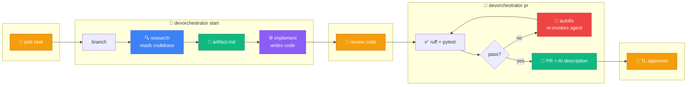

<div align="center">

# 🎼 DevOrchestrator

### The AI-native SDLC operating layer

**A developer picks a task and reviews the result.<br/>The machine does everything in between.**

<br/>

[](https://python.org)
[](#testing)
[](https://docs.astral.sh/ruff/)
[](https://claude.com/claude-code)
[](https://supabase.com)
[](#license)

<br/>

[**Quickstart**](#-quickstart) · [**The Loop**](#-the-loop) · [**How It Works**](#-how-it-works) · [**Architecture**](#-architecture) · [**Vision**](#-the-bigger-idea) · [**Docs**](#-documentation)

</div>

---

## ⚡ What is this?

Most of an engineer's day isn't engineering. It's branch naming, PR descriptions, status columns, "who else is touching this file", and re-explaining context that evaporated three standups ago.

DevOrchestrator collapses that into **three commands**. Two Claude Code sessions do the real work in tmux panes you can watch and interrupt — one **researches** the codebase and writes a plan, the other **implements** it. Quality gates run, failures get auto-repaired, a PR opens with an AI-written description, and every decision lands in a shared **mesh** your whole team can query.

> [!NOTE]
> It runs on a **Claude Code Pro subscription — no API key required**. The `claude` CLI is invoked as a subprocess in a visible tmux pane.

---

## 🔄 The Loop



**Three human moments** — pick the task, review the implementation, approve the PR. Everything between them is the machine, and you can watch all of it happen live.

---

## 🚀 Quickstart

```bash
# 1 · install
uv sync                          # or: pip install -e .

# 2 · set up once — scaffolds config + .env, tests every connection for real
devorchestrator init

# 3 · every task
devorchestrator start            # pick → research → implement (watch the panes)
devorchestrator pr               # gates → autofix → PR
devorchestrator review           # (TL) approve or reject
```

<details>
<summary><b>Minimal <code>devOrchestrator.yaml</code></b></summary>

```yaml
name: your-name
role: dev                        # dev | tl
agent: claude                    # BYO agent — claude today, others next

board:
  type: github
  url: https://github.com/you/your-repo
  token_env: GITHUB_TOKEN
  project_number: 10             # GitHub Project (v2) number

git:
  type: github
  url: https://github.com/you/your-repo
  token_env: GITHUB_TOKEN
  reviewer: teammate-login       # who `review` routes PRs to

brain:                           # optional — writes PR descriptions
  provider: siliconflow
  model: deepseek-ai/DeepSeek-V4-Flash
  token_env: SILICONFLOW_API_KEY

mesh:                            # shared team memory
  supabase_url: https://<project>.supabase.co
  supabase_key_env: SUPABASE_SERVICE_KEY
```

> [!WARNING]
> `GITHUB_TOKEN` needs **both** `repo` and `project` scopes — the second is for Projects v2 GraphQL. `init` checks this and tells you if it's missing.
>
> Model ids are **provider-specific**. SiliconFlow serves `deepseek-ai/DeepSeek-V4-Flash`; OpenRouter spells the same model `deepseek/deepseek-v4-flash`. Crossing them fails *silently* into a mechanical fallback — change `provider` and `model` together.

</details>

---

## 🎛 Commands

| Command | What it does |
|:--|:--|
| `init` | Scaffolds `devOrchestrator.yaml` + `.env`, then makes **real** API calls to verify the token can see your repo and board |
| `start` | Pick a task → branch → research session → artifact → implementation session |
| `pr` | Runs `ruff` + `pytest`, auto-repairs failures by re-invoking the agent, opens a PR with an AI-written body |
| `review` | **(TL)** Diff, tests, CI status and artifact side by side → approve or reject |
| `sessions` | List, attach to, or reap orchestrator tmux sessions |
| `mesh` | Team activity dashboard — add `--watch` for live, `--check <module>` for overlap warnings |
| `decision` | Log an architectural decision into shared memory, visible team-wide |
| `status` | Resolved config for this workspace |

---

## 🧠 How It Works

Two ideas carry the weight, and they're why this is trustworthy where "agents chatting to each other" is not.

<table>
<tr>
<td width="50%" valign="top">

### 📄 The Artifact

A structured Markdown spec — context, sub-tasks, files to touch, acceptance criteria — written by a research session that **actually opened the files**.

A chat model handed a task description produces a plausible-looking plan. A Claude Code session with file and search tools produces one grounded in the real codebase.

It's the contract between *what we decided* and *what got built*, and you can edit it before implementation starts.

</td>
<td width="50%" valign="top">

### 🕸 The Mesh

A Supabase/Postgres event store recording **who is touching what**, live session state, and architectural decisions.

Three tables — `events`, `sessions`, `devs` — scoped per project. It powers conflict warnings ("someone else is in this module"), the live dashboard, and durable team memory.

It's also exposed over **MCP**, so any Claude Code instance can query it as tools.

</td>
</tr>
</table>

### Escalation, not interruption

```
   AI ──▶ AI          routine check failures repaired automatically (autofix)
     │
     ▼ unresolved
   AI ──▶ Human       escalated with full context — diff, tests, artifact
     │
     ▼ cross-cutting
 Human ◀─▶ Human      humans make the strategic call
     │
     ▼
 Human ──▶ AI         decision logged back into the mesh for reuse
```

### 🔌 MCP server

The mesh is exposed as tools to any MCP-capable agent — so a teammate's Claude Code can ask what the team is doing without running the CLI at all.

```bash
python -m devorchestrator.mcp        # stdio · http · streamable-http · sse
```

| Tool | Purpose |
|:--|:--|
| `who_is_touching` | Who else is working in a module right now |
| `active_sessions` | Live research/impl sessions across the team |
| `recent_decisions` | Recent architectural decisions with provenance |
| `log_decision` | Record a decision into shared memory |
| `log_session_event` | Emit a session lifecycle event |

See **[docs/MCP.md](docs/MCP.md)**.

---

## 🏗 Architecture

Built as four **conflict-free lanes** with disjoint file ownership, talking only through `contracts.py` — frozen Protocols and frozen dataclasses, no lane importing another's internals.

```
src/devorchestrator/
│
├── contracts.py         🔒 the frozen coordination surface — every lane depends on this
├── config.py               Pydantic v2 schema, fails loud with actionable hints
│
├── pipeline.py          🅰 Spine — start() → prepare_pr(), the loop itself
├── review.py            🅰 TL approval gate
├── cli.py               🅰 Typer + Rich command surface
│
├── integrations/        🅱 GitHub board + git adapters, task selector
│
├── sessions/            🅲 AI sessions
│   ├── tmux_runner.py      spawns agents in split panes, rate-limit retries
│   ├── research.py         codebase → artifact.md
│   ├── impl.py             artifact.md → code
│   ├── artifact.py         parse + render the artifact
│   ├── manage.py           list / attach / reap tmux sessions
│   └── brain.py            cheap open model for text-only work
│
├── mesh/                🅳 shared memory
│   ├── store.py            Supabase event store
│   ├── conflict.py         overlap detection between devs
│   └── dashboard.py        live Rich team view
│
├── checks/              🅳 ruff + pytest quality gates
├── notify.py            🅳 Mattermost / Teams webhooks
└── mcp/                    mesh as MCP tools
```

**Everything optional degrades instead of breaking.** No mesh configured? The loop runs. Mesh unreachable? Events are dropped and counted, the session continues. No brain key? PR descriptions fall back to a deterministic template that *says so* rather than passing off invented prose. tmux missing? Sessions run headless with tee'd logs.

<details>
<summary><b>Lane ownership</b> — how four people built this in parallel without merge hell</summary>

| Lane | Owner | Owns |
|:--|:--|:--|
| **A — Spine** | harsha | `cli.py`, `contracts.py`, `config.py`, `pipeline.py`, `review.py` |
| **B — Integrations** | yuvaraj | `integrations/*`, demo tooling |
| **C — AI sessions** | ragav | `sessions/*`, `prompts/` |
| **D — Mesh + Gates** | tharun | `checks/*`, `mesh/*`, `pr_description.py`, `notify.py` |

One file, one owner. `contracts.py` is written once and frozen. Full rules in **[docs/TEAM-WORKFLOW.md](docs/TEAM-WORKFLOW.md)**.

</details>

---

## 🌍 The Bigger Idea

DevOrchestrator is the **first buildable slice** of the *AI-Native Enterprise* — where every human role has a policy-aware AI companion, and coordination happens through shared structured memory instead of tribal knowledge.

The AI doesn't replace the human. They operate as a team:

| | |
|:--|:--|
| **🤖 AI handles** | implementation, boilerplate, routine coordination, documentation, progress tracking, context preservation |
| **👤 Humans handle** | architecture, product decisions, review, approvals, hard edge cases, creative problem solving |

You can't ship "a companion for every role" on day one — so this starts with the engineering SDLC loop, where the payoff is fastest and most measurable.

| Vision concept | Mechanism here | Status |
|:--|:--|:--|
| Every role has a companion | Per-dev research + implementation sessions | ✅ Built |
| Coordinate through shared memory | Artifact + Context Mesh | ✅ Built |
| Escalation model | Quality gates → autofix → TL gate | ✅ Built |
| Persistent org memory | Mesh events + logged decisions | ✅ Built |
| Bring Your Own Agent | Agent adapter layer | 🟡 Partial |
| Governance / policy engine | Least-privilege, audit log | 🔭 Horizon |
| Agent-connection protocol | The moat — any compliant agent plugs in | 🔭 Horizon |

Full vision, including what we deliberately haven't hand-waved: **[docs/vision.md](docs/vision.md)**.

### What we deliberately *don't* do

- **No unsupervised agent-to-agent contract negotiation.** Two non-deterministic agents "negotiating an API" is two hallucination surfaces talking. Coordination goes through the artifact, the mesh, and a human gate.
- **Memory needs provenance, not just capture.** Entries are facts-at-a-time that can be superseded — a stale decision cited confidently is worse than no memory at all.
- **No monolith.** We trigger CI/CD and project tooling; we don't reimplement them. The orchestrator owns *the loop*, nothing else.
- **CLI, not an IDE plugin.** A live tmux pane you can watch and interrupt is the right surface.

---

## 🧪 Testing

```bash
uv sync                          # must not be skipped — see below
ruff check src/ tests/
pytest tests/ -q                 # 278 passing
```

> [!IMPORTANT]
> **A skipped test is not a passing test.** The real-tmux integration tests skip silently when `libtmux` is missing — and a genuine bug (the implementation pane overwriting the research pane) once survived a fully green suite that way.
>
> `tests/test_packaging.py` now fails loudly if `uv.lock` drifts from `pyproject.toml`, and the tmux skip message distinguishes *"no tmux binary"* (fine) from *"tmux present, libtmux missing"* (broken environment).

---

## 📚 Documentation

| Doc | What's in it |
|:--|:--|
| **[DEMO.md](docs/DEMO.md)** | **Start here to run it** — setup, the three commands, what to do when something breaks |
| [GAPS.md](docs/GAPS.md) | Honest inventory of what's finished vs. still open |
| [vision.md](docs/vision.md) | The full AI-Native Enterprise vision and open questions |
| [TEAM-WORKFLOW.md](docs/TEAM-WORKFLOW.md) | Four conflict-free lanes, wave timeline, git flow |
| [spine.md](docs/spine.md) | Every `contracts.py` type, pipeline walkthrough, adapter skeletons |
| [MCP.md](docs/MCP.md) | Mesh MCP server — tools, transports, wiring it to Claude Code |
| [DECISIONS.md](docs/DECISIONS.md) | Architectural decisions with rationale |
| [research.md](docs/research.md) | Problem, competitive landscape, tech decisions, risks |
| [product-backlog.md](docs/product-backlog.md) | Ordered backlog: MVP epics + vision epics |

---

## 🛠 Tech Stack

<div align="center">

`Python 3.12+` · `Pydantic v2` · `Typer` · `Rich` · `libtmux` · `httpx` · `Supabase/Postgres` · `FastMCP` · `ruff` · `uv`

**Agent:** `claude` CLI (Pro subscription, no API key) · **Brain:** SiliconFlow / DeepSeek

</div>

---

<div align="center">

### License

MIT — declared in `pyproject.toml`.<br/>
<sub>⚠️ No `LICENSE` file in the repo yet; worth adding one before this goes public.</sub>

<br/>

*Built for FRONTIER 2026.*<br/>
<sub>Three commands. Two AI sessions. One shared memory.</sub>

</div>
